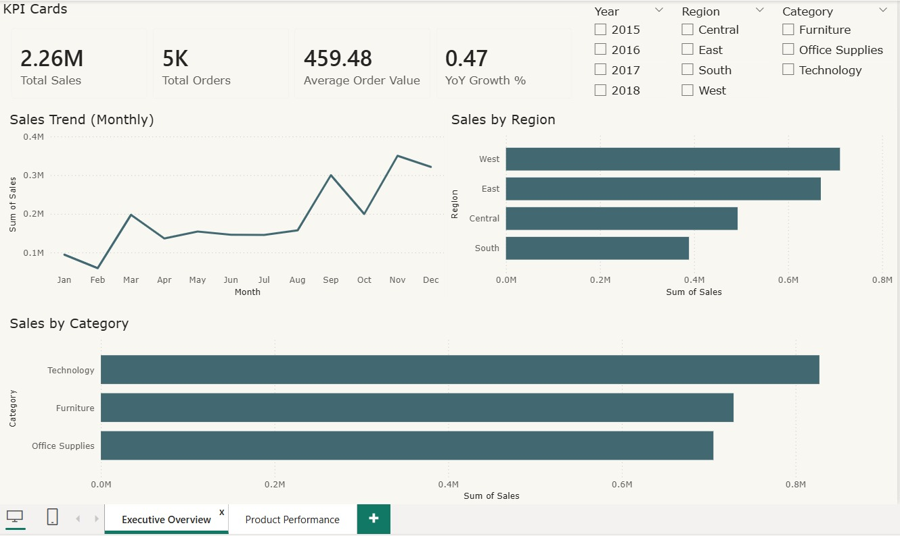
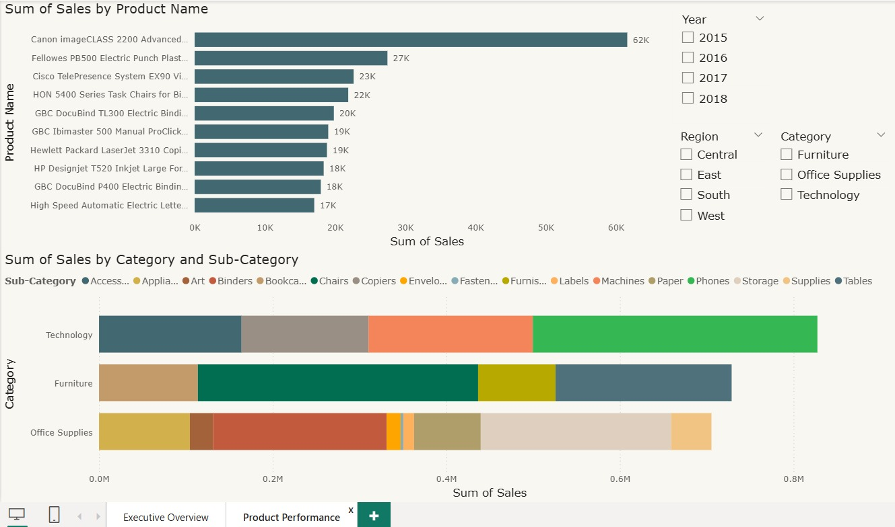

# Sales Performance Dashboard

An interactive **Power BI dashboard** designed to analyze executive sales performance and business revenue trends.

## Key Features

* Revenue and profit KPIs
* Regional sales breakdown
* Product category analysis
* Monthly revenue trends
* Executive performance comparison

## Tools Used

Power BI
Data Visualization
Business Analytics

## Dashboard Preview

### Overview

### Product Performance

## Insights

The dashboard helps stakeholders quickly identify:

* Top performing regions
* Revenue growth trends
* High performing executives
* Product category contribution
